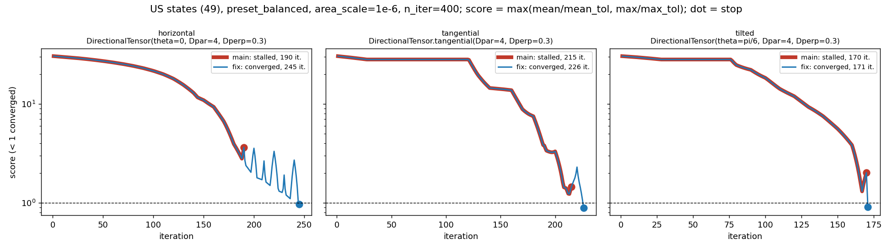
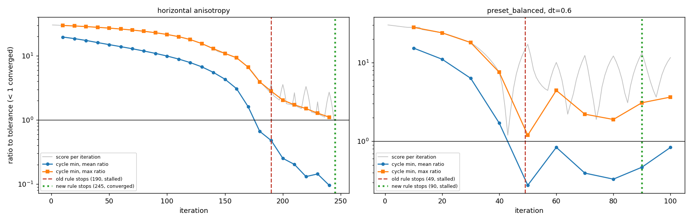
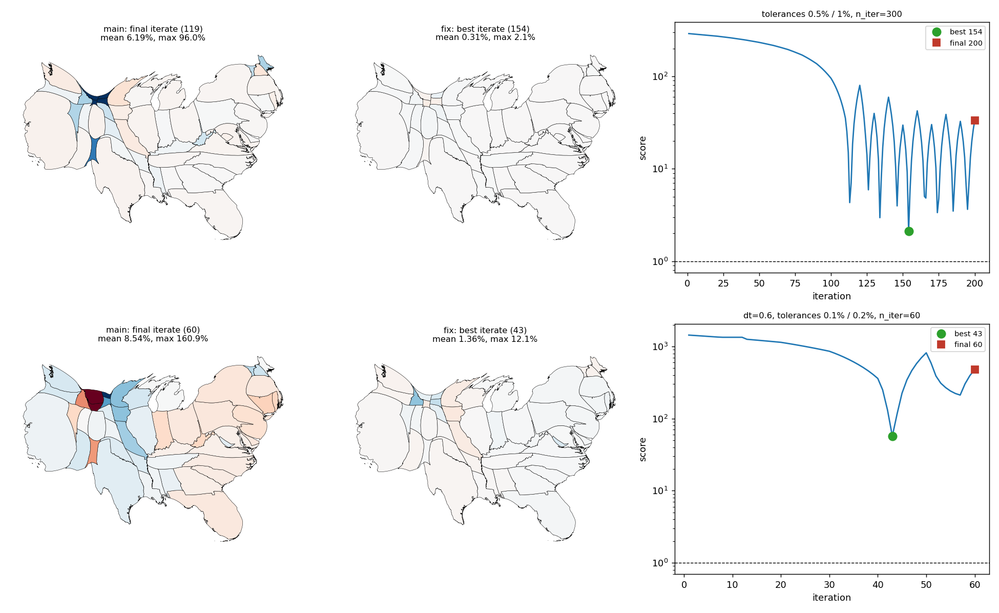
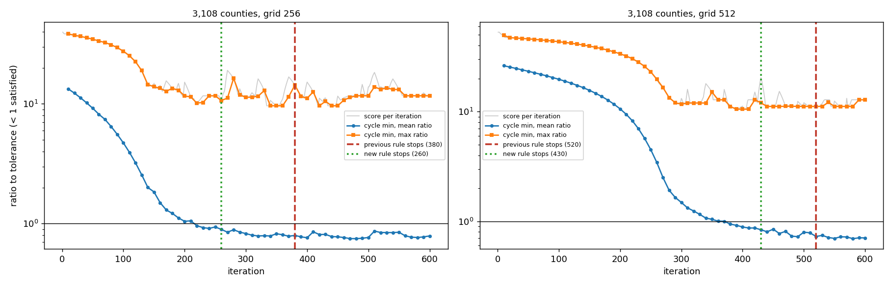

## What changed

- Stall rule: a cycle is a fixed window of `max(recompute_every, 10)` iterations counted from iteration 1, independent of when the field is recomputed. Per cycle the minimum of the mean ratio (`mean/mean_tol`) and of the max ratio (`max/max_tol`) is recorded; a ratio below 1 is satisfied. A component counts only while it is still violated (cycle minimum above 1) and its minimum is lower than that component's best so far by at least `stall_min_improvement` (default 2%); improvements of a satisfied component do not count. A cycle is progress if a component counts. The run stalls after `stall_patience` consecutive cycles without progress (default 4; it was a cumulative count of 5 mean-error increases). `None` still disables it.
- `MorphOptions.recompute_on_rise` (see below): opt-in in the second-to-last commit; the last commit (8441681) sets its default to 0.01 and can be dropped. The tables below set it explicitly, and make_figures.py runs the stall comparisons with the fixed schedule.
- Best iterate: a run that ends without converging (`STALLED` or `COMPLETED`) returns the iterate with the lowest per-iteration score `max(mean ratio, max ratio)` (geometry, landmarks and coords from the same iteration). The final iterate keeps its snapshot, listed before the best one.
- `Cartogram.best_iteration` and `Cartogram.stop_reason` (`StopReason`: `CONVERGED`, `STALL_PATIENCE`, `ITERATION_LIMIT`).

## Strong anisotropy (trajectories.png)

Score per iteration (below 1 is converged), dot = stop. The curves of main and fix coincide until main stops. Main stalls at 190, 215 and 170; the fix runs on and converges. The tangential and tilted runs have a plateau of about 90 iterations where the max error stays fixed while the mean error falls; that counts as progress through the mean component.

## Cycle minima (cycles.png)

Per-cycle minima of the mean and max components on the sawtooth, with where the old and the new rule stop. Left: horizontal anisotropy, the cycle minima keep falling, so the new rule does not stop (converges at 245; old rule stalled at 190). Right: `preset_balanced` with `dt=0.6`, where the step is too large; the minima stop improving after iteration 50 and the new rule stalls at 90 and returns iteration 43.

## Best vs last iterate (best_vs_last.png)

Two runs that do not converge. Colors are signed area errors (-30% to 30%). Top: 0.5% / 1% tolerances, `n_iter=300` (main stalls at 119 on a spike and returns it; the new rule stalls at 200 and returns iteration 154). Bottom: `dt=0.6`, 0.1% / 0.2% tolerances, `n_iter=60`, stall detection off in both.

## Tables (make_figures.py)

Errors are of the returned state, mean / max in percent. Main uses its own default `stall_patience=5`.

| run | main: status / iterations | main: mean / max error % | fix: status / iterations | fix: mean / max error % |
|---|---|---|---|---|
| horizontal | stalled / 190 | 3.47 / 41.5 | converged / 245 (best 245) | 1.00 / 9.7 |
| tangential | stalled / 215 | 2.15 / 14.9 | converged / 226 (best 226) | 1.42 / 8.9 |
| tilted | stalled / 170 | 3.11 / 21.3 | converged / 171 (best 171) | 1.74 / 9.1 |
| default options | converged / 113 | 0.32 / 4.4 | converged / 113 (best 113) | 0.32 / 4.4 |
| grid_size=512 | converged / 214 | 0.50 / 7.3 | converged / 214 (best 214) | 0.50 / 7.3 |
| tolerances 0.5% / 1%, n_iter=300 | stalled / 119 | 6.19 / 96.0 | stalled / 200 (best 154, stall_patience) | 0.31 / 2.1 |
| dt=0.6, tolerances 0.1% / 0.2%, n_iter=60 | completed / 60 | 8.54 / 160.9 | completed / 60 (best 43, iteration_limit) | 1.36 / 12.1 |

Horizontal anisotropy with different `recompute_every` (cycles are at least 10 iterations):

| recompute_every | main: status / iterations | fix: status / iterations |
|---|---|---|
| 1 | converged / 183 | converged / 183 |
| 2 | converged / 185 | converged / 185 |
| 5 | stalled / 189 | converged / 198 |
| 10 | stalled / 190 | converged / 245 |

Presets (US states):

| options | main: status / iterations | fix: status / iterations |
|---|---|---|
| preset_fast | completed / 30 | completed / 30 |
| preset_balanced | completed / 100 | completed / 100 |
| preset_high_quality | completed / 300 | completed / 300 |
| preset_balanced, dt=0.6 | stalled / 49 | stalled / 90 |

`preset_fast` has 30 iterations, three cycles, and a stall needs a progress cycle followed by 4 cycles without progress, so it cannot stall.

Multiresolution (`min_resolution=128`, default options, best of 3 timings at low machine load; the workflow trigger is unchanged):

| data | levels | main: per level status / iterations | main total | fix: per level | fix total | time main / fix (s) |
|---|---|---|---|---|---|---|
| states | 3 | stalled/66; converged/15 | 81 | stalled/100; converged/34 | 134 | 0.2 / 0.3 |
| states | 4 | stalled/66; converged/15 | 81 | stalled/100; converged/34 | 134 | 0.2 / 0.3 |
| districts | 3 | stalled/136; converged/43 | 179 | stalled/240; converged/3 | 243 | 0.8 / 1.0 |
| districts | 4 | stalled/136; converged/43 | 179 | stalled/240; converged/3 | 243 | 0.8 / 1.0 |

Both rules end the first level stalled and the second converged, so the number of levels run is unchanged (2). The coarse level runs longer before it stalls (the timings were taken at a load average of about 19, so only the iteration counts are reliable). With stall detection off, the states level 1 converges at 346 after a max-error plateau of about 200 iterations; the new rule stops it at 100.

Counties (3,108, prepared set, not bundled; `area_scale=1e-6`, `n_iter=1000`, default tolerances, fixed recompute schedule; stop iteration and best score, below 1 is converged):

| grid | old rule (patience 5) | patience 150 | either component counts (previous commit) | violated components only (now) |
|---|---|---|---|---|
| 256 | stalled / 198, best 11.65 | stalled / 485, best 9.64 | stalled / 380, best 9.64 | stalled / 260, best 10.16 |
| 512 | stalled / 309, best 11.66 | stalled / 540, best 10.50 | stalled / 520, best 10.50 | stalled / 430, best 10.50 |

None converge. The mean ratio is below 1 from about iteration 220 (256) and 360 (512); the max ratio sits at 10 to 12 (counties.png). Counting only violated components removes the creep of the satisfied mean component and stops 120 / 90 iterations earlier. The max-ratio window minima still improve by 2% or more until iteration 220 (256) and 390 (512), which is why the stop is not earlier; at `stall_min_improvement=0.05` the 512 run would stop at 50, before its max error has started to fall (replay on the stored per-iteration errors).

## Recompute on rise (opt-in, recompute_on_rise.png)

`MorphOptions.recompute_on_rise` (default `None` until the last commit, then 0.01): when the score rose by more than that relative amount in the last iteration, the velocity field is recomputed before the next iteration; `recompute_every` stays the maximum interval. The stall windows are fixed windows of `max(recompute_every, 10)` iterations from iteration 1, so the off path is unchanged (all iteration counts above are identical). Below: off vs on with 0.01 (fix only). Cost = iterations + recomputes x (9, 12, 24 at grid 128, 256, 512), one recompute in plain-step units; rises = iterations where the score rises while below 20.

| run | status | iterations | recomputes | rises | mean / max error % | best score | cost |
|---|---|---|---|---|---|---|---|
| horizontal, off | converged | 245 | 25 | 17 | 1.00 / 9.7 | 0.97 | 545 |
| horizontal, on | converged | 233 | 27 | 9 | 1.30 / 9.6 | 0.96 | 557 |
| horizontal, recompute_every=5, off | converged | 198 | 40 | 2 | 1.04 / 9.9 | 0.99 | 678 |
| horizontal, recompute_every=5, on | converged | 200 | 41 | 1 | 1.22 / 10.0 | 1.00 | 692 |
| tangential, off | converged | 226 | 23 | 10 | 1.42 / 8.9 | 0.90 | 502 |
| tangential, on | converged | 216 | 23 | 4 | 1.99 / 8.6 | 0.86 | 492 |
| tilted, off | converged | 171 | 18 | 3 | 1.74 / 9.1 | 0.92 | 387 |
| tilted, on | converged | 169 | 18 | 1 | 1.10 / 9.5 | 0.95 | 385 |
| default, off / on | converged | 113 | 12 | 0 | 0.32 / 4.4 | 0.45 | 257 |
| grid 512, off / on | converged | 214 | 22 | 0 | 0.50 / 7.3 | 0.74 | 742 |
| tolerances 0.5% / 1%, n_iter=300, off | stalled | 200 | 20 | 28 | 0.31 / 2.1 | 2.12 | 440 |
| tolerances 0.5% / 1%, n_iter=300, on | converged | 115 | 13 | 1 | 0.07 / 0.6 | 0.62 | 271 |
| dt=0.6, tight, n_iter=60, no stall, off | completed | 60 | 6 | 0 | 1.36 / 12.1 | 57.10 | 132 |
| dt=0.6, tight, n_iter=60, no stall, on | completed | 60 | 13 | 0 | 0.87 / 4.6 | 22.31 | 216 |
| preset_balanced, dt=0.6, off | stalled | 90 | 9 | 27 | 1.36 / 12.1 | 1.20 | 198 |
| preset_balanced, dt=0.6, on | converged | 45 | 6 | 1 | 0.87 / 4.6 | 0.47 | 117 |
| districts 256, off | converged | 154 | 16 | 4 | 1.08 / 8.4 | 0.85 | 346 |
| districts 256, on | converged | 150 | 16 | 2 | 1.07 / 8.0 | 0.81 | 342 |
| districts 512, off / on | converged | 263 | 27 | 0 | 0.60 / 9.5 | 0.95 | 911 |

Multiresolution (default options, `min_resolution=128`; per level grid: status / iterations / recomputes):

| data | recompute_on_rise | per level | total iterations | cost |
|---|---|---|---|---|
| states, 3 or 4 levels | off / on | 128: stalled/100/10; 256: converged/34/4 | 134 | 272 |
| districts, 3 or 4 levels | off | 128: stalled/240/24; 256: converged/3/1 | 243 | 471 |
| districts, 3 or 4 levels | on | 128: converged/231/36 | 231 | 555 |

Counties (3,108, prepared set, not bundled, run outside the script; `area_scale=1e-6`, `n_iter=1000`; none converge; cost ratios 47.5 and 28.5 at grid 256 and 512):

| run | status | iterations | recomputes | rises | mean / max error % | best score | cost |
|---|---|---|---|---|---|---|---|
| grid 256, off | stalled | 260 | 26 | 30 | 4.85 / 163.5 | 10.16 | 1495 |
| grid 256, on | stalled | 300 | 45 | 40 | 4.47 / 156.2 | 9.87 | 2438 |
| grid 512, off | stalled | 430 | 43 | 41 | 4.59 / 172.0 | 10.50 | 1656 |
| grid 512, on | stalled | 390 | 43 | 31 | 7.98 / 204.0 | 11.66 | 1616 |

Recompute on rise halves the rises on the strong-anisotropy runs at about the same cost, needs more iterations than `recompute_every=5` (233 vs 198) but fewer recomputes, so its cost is lower (557 vs 678) and about that of `recompute_every=10` (545), and converges two runs that stall or oscillate otherwise (0.5% / 1% tolerances, `dt=0.6`). On counties it is 63% more costly at grid 256 (2438 vs 1495) and 2% cheaper at grid 512 (1616 vs 1656) with a worse best score there (11.66 vs 10.50), because the runs stall at different points. With the horizontal run at `recompute_every` 2 and 1, on and off are identical (no rises); the presets and `districts 512` are identical too. Districts multiresolution is the one case where it changes the level count (2 to 1), at 18% higher cost (555 vs 471) but 12 fewer iterations (231 vs 243).

The default and grid-512 runs are identical to main (same iteration counts and errors). The cartogram-cpp states example from the issue is not bundled and was not run.
