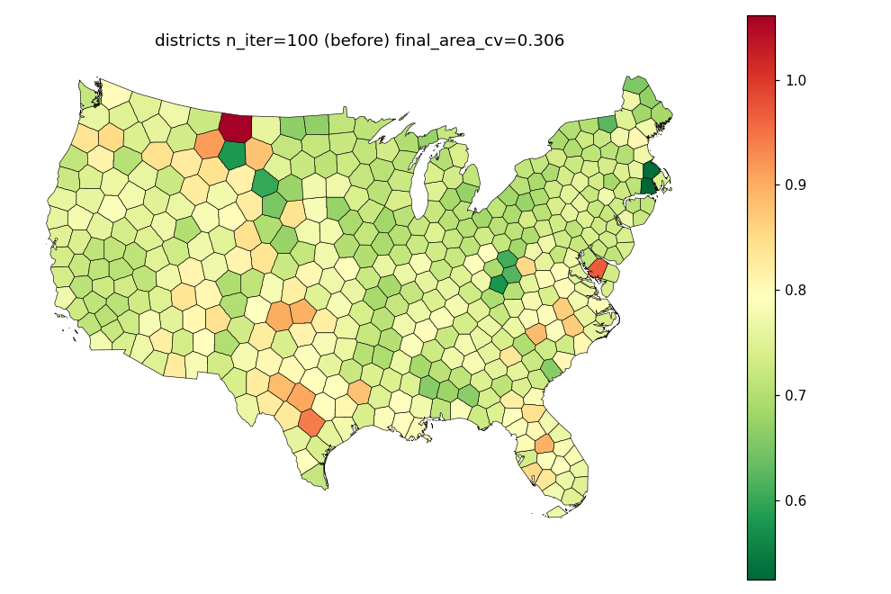
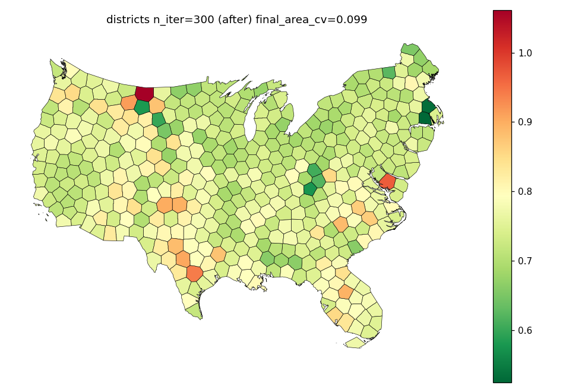
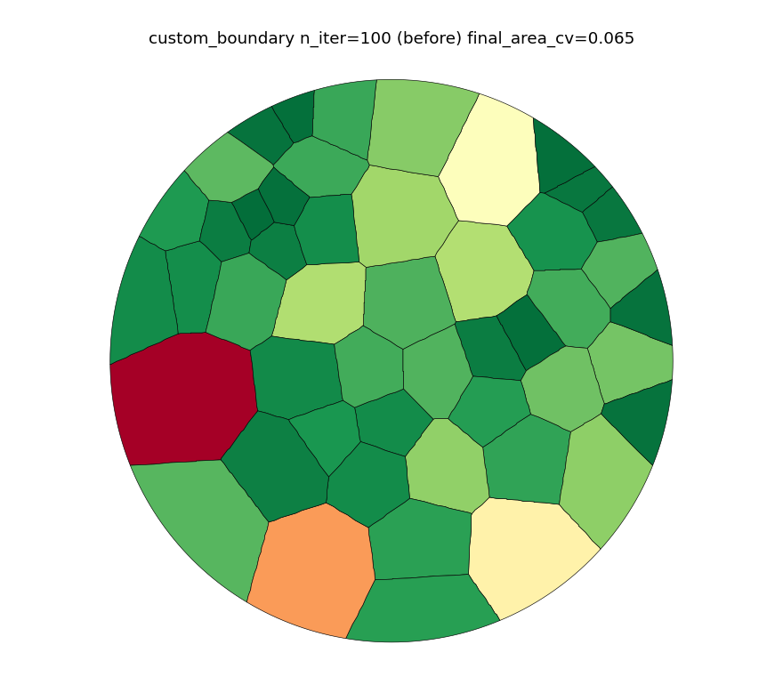
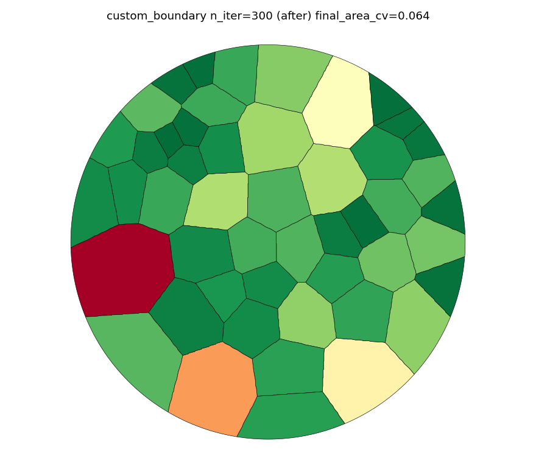

# Piece 1 - fastmath determinism

See `fastmath_findings.md` for the full writeup. Short version:

- Harness: `det_harness.py` in this directory.
- 45 runs across 5 configurations (states/districts, undensified and
  densified to 391,644 coords - bracketing the reported 364,086-coord
  repro), at `n_iter` 60/100/500. **Zero divergence in any run** -
  every run's coordinate checksum was bit-identical to every other run
  of the same configuration.
- Code review: both flagged kernels (`flow_cartogram/displacement.py:88`,
  `geo_utils/geometry.py:132`) write strictly independent per-index
  outputs under `prange`; any cross-thread accumulation happens in an
  explicit sequential loop afterward. Neither performs a thread-shared
  floating-point reduction, so there is no mechanism by which parallel
  scheduling order (with or without `fastmath`) could change the result.
- **Decision: held back.** Could not reproduce the problem this fix is
  meant to solve, so the fix cannot be verified. No code change shipped
  for this piece. See `fastmath_findings.md` for recommended next steps
  if a human wants to re-open this on the original repro environment.
- Raw logs: `fastmath_repro_districts_n100.txt` (districts, n_iter=100,
  20 runs), `fastmath_repro_states_n500.txt` (states densified to
  391,644 coords, n_iter=500, 5 runs).

# Piece 2 - Voronoi docs convergence

`n_iter` raised 100->300 (30->300 in `choose-backend.ipynb`) in:
- `docs/examples/voronoi_cartogram/plot_voronoi_districts.py`
- `docs/examples/voronoi_cartogram/plot_voronoi_custom_boundary.py`
- `docs/examples/voronoi_cartogram/plot_voronoi_elastic_boundary.py`
- `docs/how-to/voronoi_cartogram/choose-backend.ipynb`

`area_cv_tol` self-stops each script early once converged, so cost is
well below the full 300 iterations in every case that has a tolerance set.

## Districts (docs config: RasterBackend(512, ElasticBoundary(0.02)), area_cv_tol=0.1, tol=2500)

| n_iter | iterations used | final area_cv | mean area error | wall time |
|---|---|---|---|---|
| 100 (before) | 100 (did not converge) | 0.306 | 26% | baseline |
| 300 (after) | 176 (self-stopped) | 0.099 | 8.1% | +12s |




## Custom boundary (RasterBackend(256), circle boundary, area_cv_tol=0.05)

| n_iter | final area_cv | wall time |
|---|---|---|
| 100 (before) | 0.0647 | baseline |
| 300 (after) | 0.0639 | +1.6s |

Already close to `area_cv_tol` at n_iter=100, so the visual/metric change
here is small - included for completeness.




## Elastic boundary example (RasterBackend(256), area_cv_tol=0.05)

Measured directly (not full mkdocs build):

| variant | n_iter=100 final area_cv | n_iter=300 final area_cv | added wall time |
|---|---|---|---|
| fixed boundary | 0.1946 | 0.1677 | +1.7s |
| elastic boundary | 0.0473 (already converged) | 0.0473 | ~0s |

The fixed-boundary variant does not reach `area_cv_tol=0.05` even at
n_iter=300 - expected, since the whole point of the example is to show
that a fixed boundary converges worse than an elastic one at the periphery.

## choose-backend.ipynb (RasterBackend(300) and ExactBackend, no area_cv_tol set)

No `area_cv_tol`, so these always run the full `n_iter`:

| backend | n_iter=30 | n_iter=300 | added wall time |
|---|---|---|---|
| Raster | 1.2s, cv=0.0772 | 3.2s, cv=0.0246 | +2.0s |
| Exact | 1.6s, cv=0.3866 | 14.5s, cv=0.1288 | +12.9s |

Total added cost for this notebook: ~+15s. `ExactBackend` still doesn't
reach a tight cv even at n_iter=300 (0.1288) - matches the notebook's own
narrative that `ExactBackend` "converges slowly," so this is expected and
not a problem to fix here.

## check-docs

`uv run mkdocs build -s` (the `check-docs` CI job) passes locally with all
of the above changes applied. See the docs-build-flake note below for an
unrelated, pre-existing intermittent failure encountered while verifying this.

# Piece 3 - leftovers

## pre_scale ordering

`prepare_layout_data` (`src/carto_flow/symbol_cartogram/layouts/data_prep.py`)
computes `mean_area`/`unit_cell_radius` from the original geometries
(step 1) before `pre_scale` rescales connected components (step 4b).
`geometry_areas` used for `size_normalization="total"` is recomputed after
prescaling, but `mean_area` (returned on `LayoutData`) and
`unit_cell_radius` (used for `size_normalization="max"`, the *default*)
are not - so `pre_scale` silently has no effect on non-mosaic layout sizing
under the default settings.

**Decision: documented, not reordered.** Reordering changes non-mosaic
layout output and needs its own measurement/decision per the standing
rules; documenting is the safe, non-behavior-changing option. Added
`TestPreScale.test_pre_scale_does_not_change_mean_area_or_max_normalized_sizes`
in `tests/test_symbol_cartogram_mosaic.py` pinning the current, documented
behavior so a future reordering change is a deliberate, visible diff.

## tile-count-maps.ipynb cleanup

Dropped cells calling `geographic_grouped_cartogram` / `.placement_metrics`
(exploratory, disconnected from the guide's `tile_count`/`group_by`
narrative) and a trailing empty cell.

## Docs build flake - OverflowError in mkdocs_gallery

Reproduced on a clean `mkdocs build -s`:

```
File ".../mkdocs_gallery/gen_gallery.py", line 633, in _sec_to_readable
    t = datetime(1, 1, 1) + timedelta(seconds=t)
OverflowError: date value out of range
```

Re-ran the identical build immediately after (same code, same machine) and
it succeeded - confirmed intermittent, not a deterministic failure tied to
our changes. `_sec_to_readable` is upstream `mkdocs-gallery==0.10.4` code
(`gen_gallery.py:627-635`); most likely a rare negative or otherwise
malformed `exec_time` for one script pushes the `timedelta` below
`datetime.min`. Fixing it would require patching third-party
`site-packages`, which is invasive and not durable across dependency
updates - reporting per the standing rule rather than working around it.
No code change made for this item; flagging for a human to consider
reporting upstream or pinning a version if/when one fixes it.

## FlowDensityLayout docstring caveats

Documented on `FlowDensityLayoutOptions` (`src/carto_flow/symbol_cartogram/layouts/flow/__init__.py`)
and in `docs/explanations/symbol-cartogram-flow-density-layout.md`:
- `cross_group_pull_scale=0` removes cross-group *pull* but does not
  isolate groups - the density field is built from all pairs together and
  covers the full domain, so groups still interact through push forces and
  shared field geometry.
- `convergence_tolerance` is checked against the *mean* relative NN
  spacing error across all pairs, not a per-pair bound, so individual
  pairs (including some residual overlap) can remain above tolerance when
  the layout reports convergence.

# Verification

- `make check` (pre-commit/ruff/mypy/deptry, lock check): clean
- `uv run pytest -q`: 487 passed
- `uv run mkdocs build -s`: succeeds (see flake note above)
- Pushed tree verified: `git log --oneline -1` on the branch equals the
  commit referenced above; PR #37 opened against `main`.
